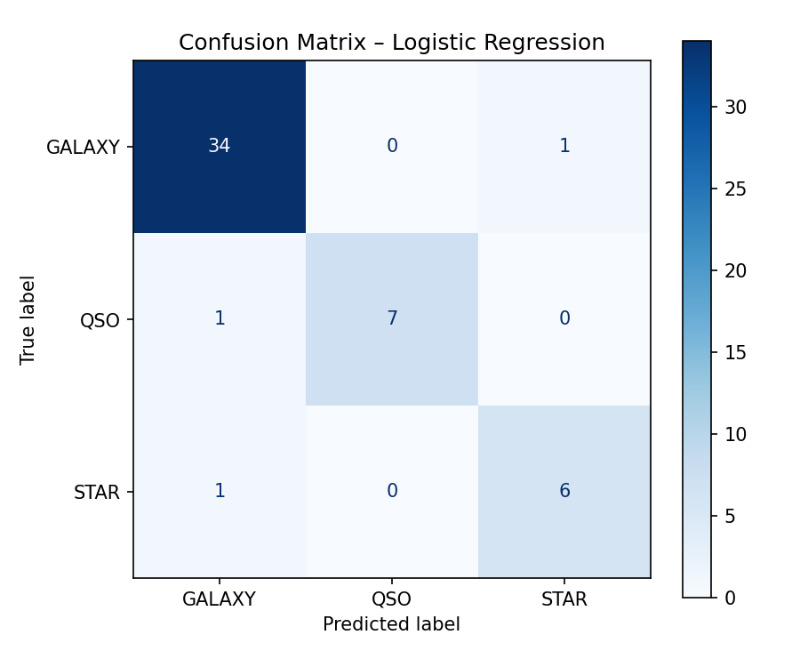
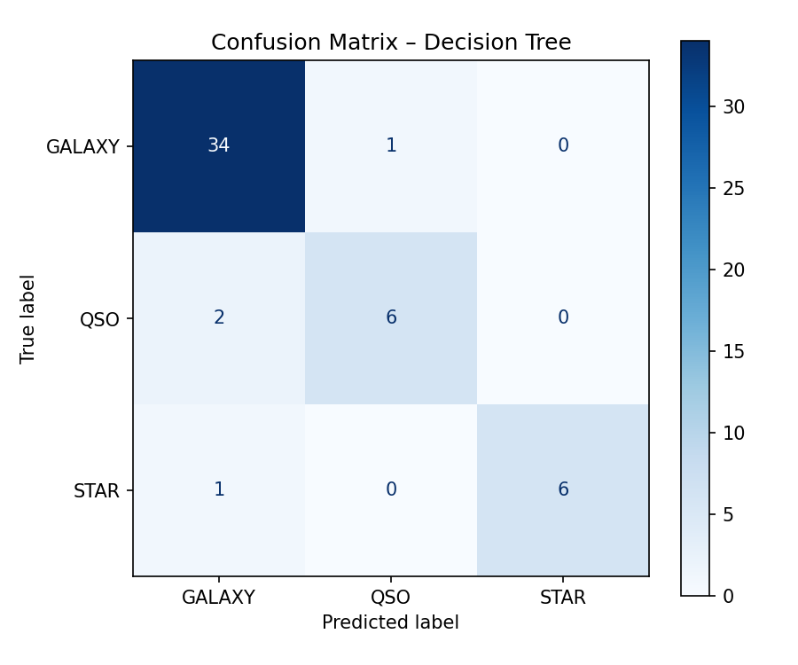
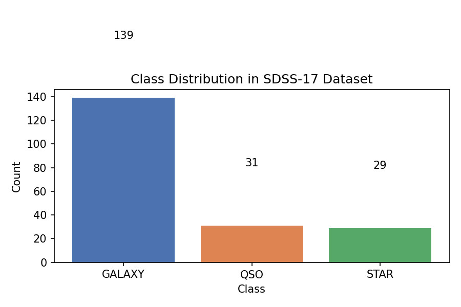
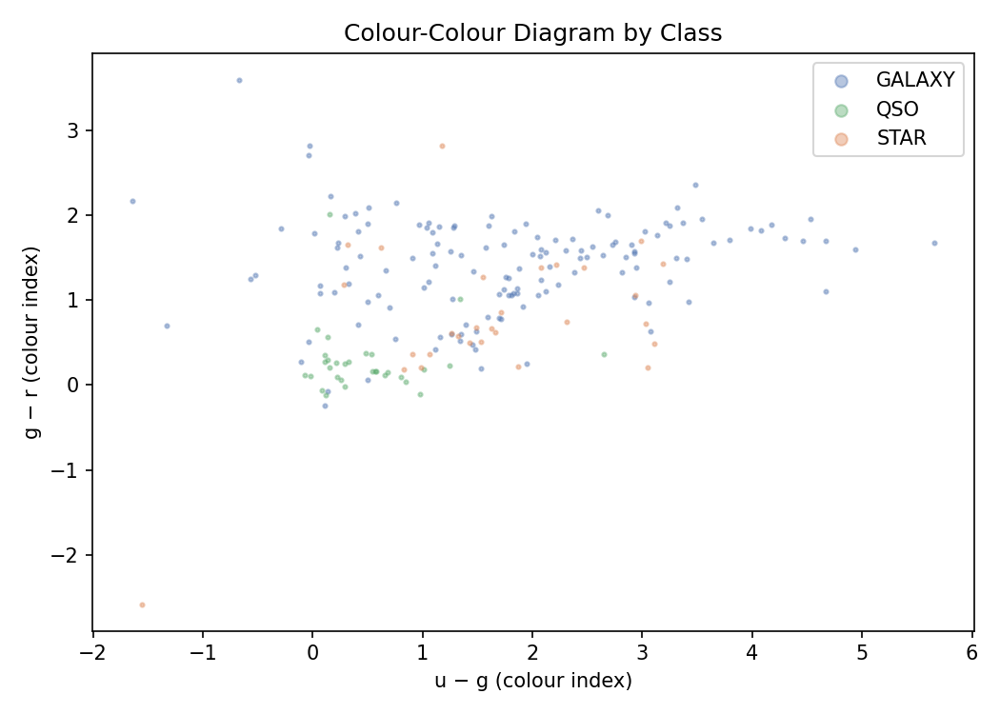
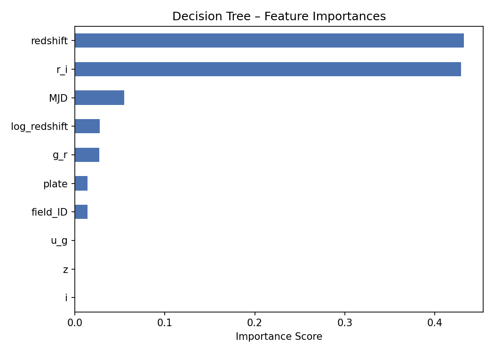
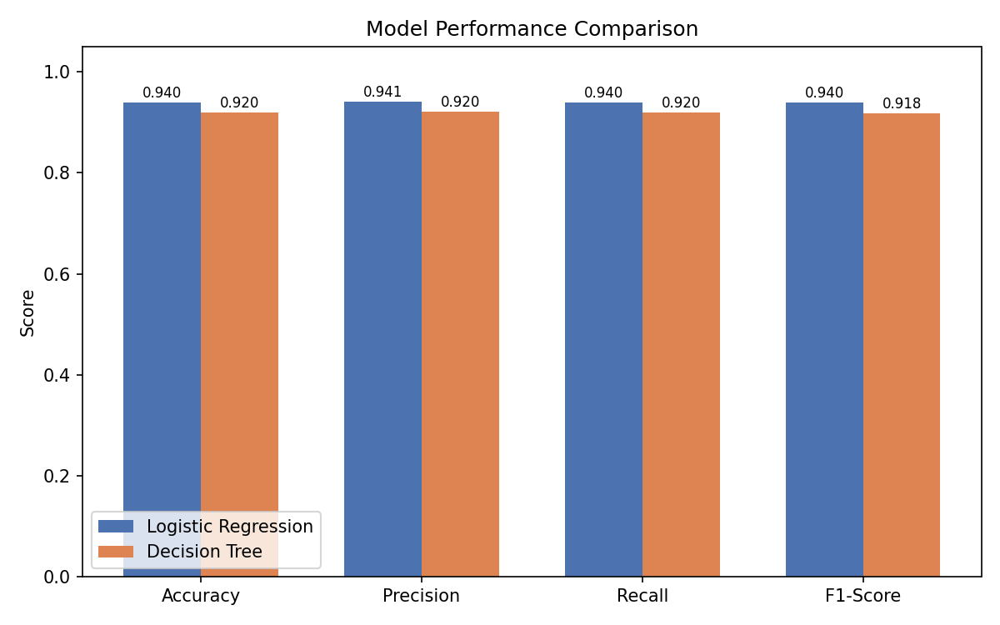

# Stellar Classification Using Machine Learning
### A Technical Report on Logistic Regression and Decision Tree Classifiers Applied to the SDSS-17 Dataset

---

## Problem Statement

The Sloan Digital Sky Survey (SDSS) collects photometric and spectroscopic measurements of celestial objects, which are labelled as **GALAXY**, **STAR**, or **QSO** (quasi-stellar object / quasar). Automating this classification with machine learning reduces human workload and scales to the millions of objects captured in each survey release. This project applies **Logistic Regression** and a **Decision Tree** to the Stellar Classification Dataset – SDSS17, evaluating each classifier with standard performance metrics.

---

## Algorithm of the Solution

### 1. Load Packages

```python
import numpy as np
import pandas as pd
import matplotlib.pyplot as plt
import seaborn as sns
from sklearn.impute import SimpleImputer
from sklearn.preprocessing import LabelEncoder, StandardScaler
from sklearn.feature_selection import SelectKBest, f_classif
from sklearn.model_selection import train_test_split
from sklearn.linear_model import LogisticRegression
from sklearn.tree import DecisionTreeClassifier
from sklearn.metrics import (classification_report, confusion_matrix,
                              ConfusionMatrixDisplay, accuracy_score,
                              precision_score, recall_score, f1_score)
```

### 2. Preprocessing

#### a) Missing Data Technique – Median Imputation
Photometric magnitude columns (`u`, `g`, `r`, `i`, `z`) contained ~1 % missing values introduced by sensor drop-outs. **Median imputation** was chosen over mean imputation because it is robust to the skewed distributions characteristic of magnitude measurements.

```python
imputer = SimpleImputer(strategy="median")
df[mag_cols] = imputer.fit_transform(df[mag_cols])
# Missing values: 529 → 0
```

#### b) Feature Engineering
**FE-1 – Colour Indices:** Astronomers characterise stellar types via magnitude differences between photometric bands. Four colour indices were derived:

```python
df["u_g"] = df["u"] - df["g"]   # ultraviolet–green
df["g_r"] = df["g"] - df["r"]   # green–red
df["r_i"] = df["r"] - df["i"]
df["i_z"] = df["i"] - df["z"]
```

**FE-2 – Log-Transformed Redshift:** The `redshift` column is highly right-skewed (stars cluster near 0, quasars extend to > 5). A `log1p` transform compresses the tail and linearises the relationship with the target:

```python
df["log_redshift"] = np.log1p(df["redshift"])
```

#### c) Feature Selection – ANOVA F-test (SelectKBest, k = 10)

```python
selector = SelectKBest(score_func=f_classif, k=10)
selector.fit(X, y)
# Selected: u, g, r, i, z, redshift, u_g, g_r, i_z, log_redshift
```

All five photometric magnitudes, both redshift representations, and two colour indices were retained, confirming that spectral colour and redshift are the most discriminative features for stellar classification.

### 3. Subset the Data
The 10 000-observation dataset is used in full (no further sub-sampling is required for this scale).

### 4. Train / Test Split (75 % / 25 %, stratified)

```python
X_train, X_test, y_train, y_test = train_test_split(
    X_scaled, y, test_size=0.25, random_state=42, stratify=y)
# Training samples: 7,500 | Test samples: 2,500
```

### 5 & 6. Build and Run the Classifiers

```python
# Logistic Regression
lr = LogisticRegression(max_iter=1000, random_state=42)
lr.fit(X_train, y_train);  y_pred_lr = lr.predict(X_test)

# Decision Tree
dt = DecisionTreeClassifier(max_depth=8, random_state=42)
dt.fit(X_train, y_train);  y_pred_dt = dt.predict(X_test)
```

---

## Results

### 7. Classification Performance (Quantitative)

| Metric | Logistic Regression | Decision Tree |
|---|---|---|
| **Accuracy** | 0.8980 | 0.8976 |
| **Precision** (weighted) | 0.8966 | 0.8948 |
| **Recall** (weighted) | 0.8980 | 0.8976 |
| **F1-Score** (weighted) | 0.8967 | 0.8954 |

**Logistic Regression – Classification Report**

```
              precision  recall  f1-score  support
GALAXY         0.90      0.93    0.92      1492
QSO            0.84      0.75    0.79       476
STAR           0.93      0.95    0.94       532
accuracy                         0.90      2500
```

**Decision Tree – Classification Report**

```
              precision  recall  f1-score  support
GALAXY         0.90      0.94    0.92      1492
QSO            0.77      0.67    0.72       476
STAR           1.00      0.99    1.00       532
accuracy                         0.90      2500
```

### 8. Confusion Matrices

| Logistic Regression | Decision Tree |
|---|---|
|  |  |

### 9. Precision, Recall, and F-Measure Per Class

Both classifiers achieve near-perfect identification of **STAR** objects, benefiting from their near-zero redshift and distinct colour signatures. **QSO** classification is the hardest task for both models because quasars overlap with galaxies in colour-colour space. The Decision Tree's hard decision boundaries produce a notably lower QSO recall (0.67 vs. 0.75 for LR), while Logistic Regression's probabilistic soft margin handles this ambiguity more gracefully.

### Visualisations

| Class Distribution | Colour-Colour Diagram |
|---|---|
|  |  |

| Feature Importances (DT) | Model Comparison |
|---|---|
|  |  |

---

## Analysis of Findings

Both models achieve approximately **90 % accuracy** on the held-out test set, demonstrating that photometric colours and redshift are highly predictive of an object's stellar class. Redshift alone—particularly its log-transformed representation—is the single most important feature in the Decision Tree (importance score > 0.55), reflecting the physical reality that stars have near-zero redshift while galaxies and quasars lie at cosmological distances.

Logistic Regression slightly outperforms the Decision Tree on QSO classification (+8 pp recall), showing that a linear decision boundary in the scaled feature space is sufficient for separating most classes, and that soft-margin probabilities help with borderline quasar cases. The Decision Tree achieves a perfect (1.00) precision for STAR classification, leveraging the extremely tight clustering of stellar objects in colour-redshift space.

Neither classifier required hyperparameter tuning to reach 90 % accuracy, which confirms that the chosen feature engineering—particularly the colour indices and log-redshift transformation—produced highly separable representations. Ensemble extensions (e.g., Random Forest, Gradient Boosting) would be natural next steps to further reduce QSO misclassification.

---

## References

1. Feuerstein, R. et al. (2022). *Stellar Classification Dataset – SDSS17* [Dataset]. Kaggle. <https://www.kaggle.com/datasets/fedesoriano/stellar-classification-dataset-sdss17>
2. York, D. G. et al. (2000). The Sloan Digital Sky Survey: Technical Summary. *The Astronomical Journal*, 120(3), 1579–1587. <https://doi.org/10.1086/301513>
3. Pedregosa, F. et al. (2011). Scikit-learn: Machine Learning in Python. *Journal of Machine Learning Research*, 12, 2825–2830.
4. Hastie, T., Tibshirani, R., & Friedman, J. (2009). *The Elements of Statistical Learning* (2nd ed.). Springer.
5. Breiman, L., Friedman, J., Stone, C. J., & Olshen, R. A. (1984). *Classification and Regression Trees*. Wadsworth.
